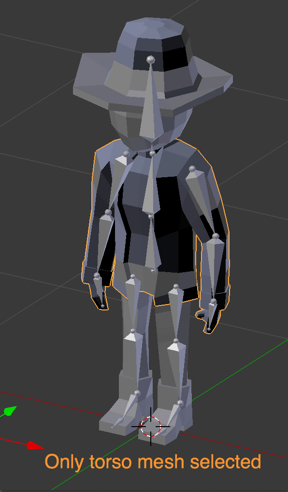
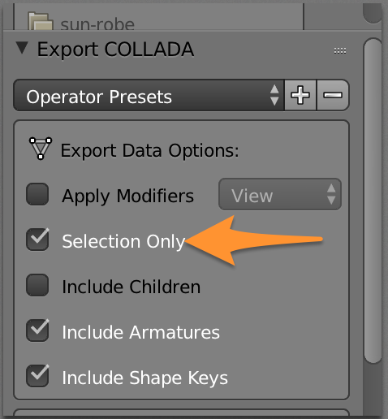
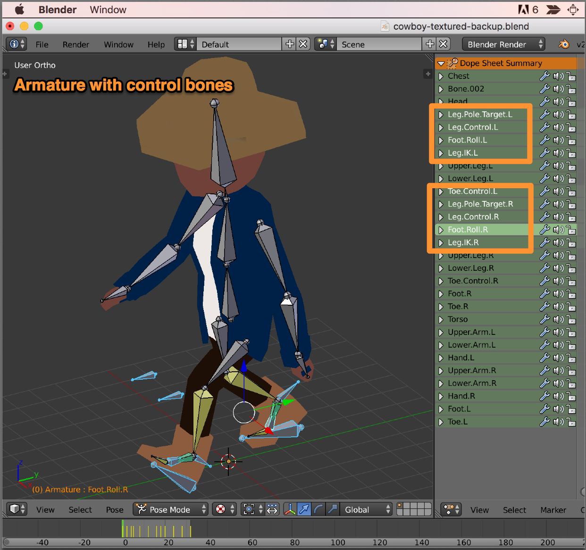
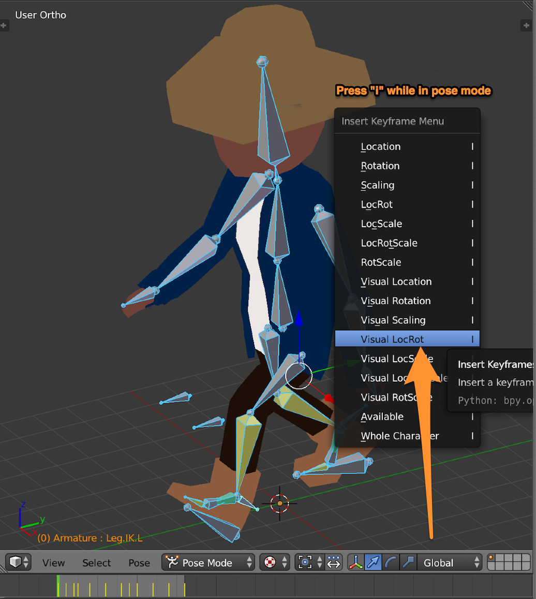
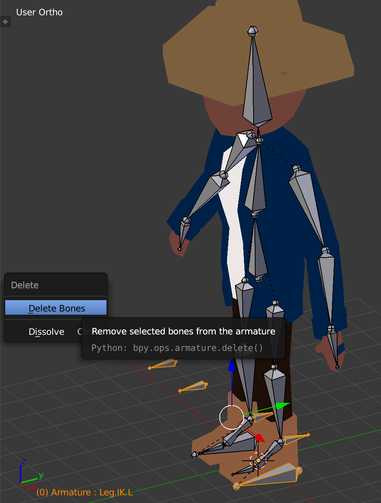

## How to Export

### Step 1 - Select your Mesh

Select your mesh in `Object mode` but *DO NOT* select your skeleton (armature).

### Step 2 - Export your Mesh

`File -> Export -> Collada`

### Step 3 - Choose your export settings

lorem ipsum

## Multiple Meshes

`collada-dae-parser` does not support files with multiple meshes.

### Option 1: Joining Meshes

You can join your geometries in `Object mode` before exporting.

*First select all of your meshes while in Object mode*

*Then join them using `Ctrl` + `J`*

### Option 2: Export Selection Only

You can choose to only export your selected mesh

## Control Joints

`collada-dae-parser` does not support control bones such as pole targets, inverse kinematic bones or control bones.

If your rig uses control bones, you'll need to apply their effects onto your deformation joints before exporting your mesh.

[tutorial on exporting IKs from blender](http://chinedufn.com/blender-export-iks-constraints)

#### 1. Start from a copy file

Begin by saving and working from a new copy of your model, since you'll be modifying your keyframes and rig before exporting.

#### 2. Visual keyframes

todo: explain why you can't just export IKs to collada

###### Duplicate constrained bones

Duplicate all bones that have constraints or inverse kinematics.

For any of the original bones are parented to one of their constraints, remove that parent.

Add a bone constraint to each of your original bones to copy their new duplicated counterpart's transforms.

http://www.harkyman.com/2010/11/26/recording-ik-movement-into-fk-bones/

###### Insert visual keyframes

Insert a visual location rotation keyframe for all bones at each keyframe.

This adds a keyframe to each joint that positions it exactly how you see it. Effectively baking the effects of
your control bones into your deformation bones.

Inserting more visual keys will lead to a closer match to your original animation. TODO: explain

#### 3. Delete control bones

Once you've added your visual keyframes you can delete all of your control bones and verify that your
animation still works.

#### 4. Delete constraints

After all of your control / IK bones are deleted and you've verified that your animation still works you'll want to delete all of your bone constraints
on your deformation bones

##### 5. Export

You can now export your collada file. If you run into a problem, please open an issue or PR!

#### TODO...

- don't using inherit rotation while modeling since the collada exporter won't handle that properly
- video demonstrating dealing with constraints
- summarize -> http://www.harkyman.com/2010/11/26/recording-ik-movement-into-fk-bones/

## Skeletons with only Rigid Motions

TODO ... explain this

lorem ipsum...

Make sure to apply scale

lorem ipsum

`CTRL` + `A` while in `Object mode` in Blender. Then `Apply the Scale`

This changes your model to be scaled at `[1.0, 1.0, 1.0]` meaning that your exported joint matrices will be rigid transforms

lorem ipsum

## Combining actions

lorem ipsum

create a new action where you'll be combining all of them

Add one keyframe to this new action

Now you are able to copy and paste to this new action.. go through your other actions one by one and copy them into this new action `Ctrl-c` then `Ctrl-v`
